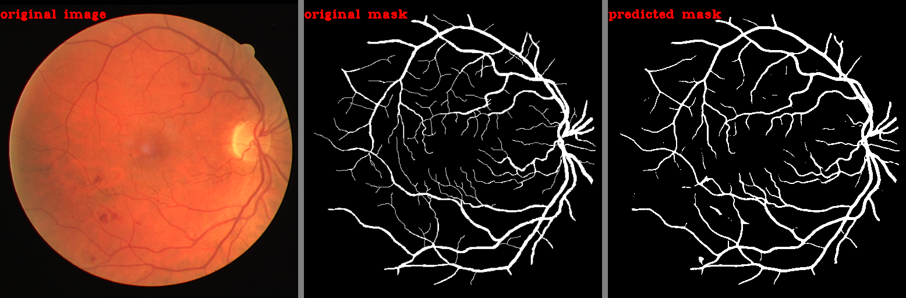

# Retina-Blood-Vessel-Segmentation-Using-UNET-In-Pytorch
Dataset Link:- https://www.kaggle.com/datasets/andrewmvd/drive-digital-retinal-images-for-vessel-extraction?resource=download. I have dropped `1st_manual` folder from `training` directory and only using `images` and `masks` folder for both `training` and `test` directory.

